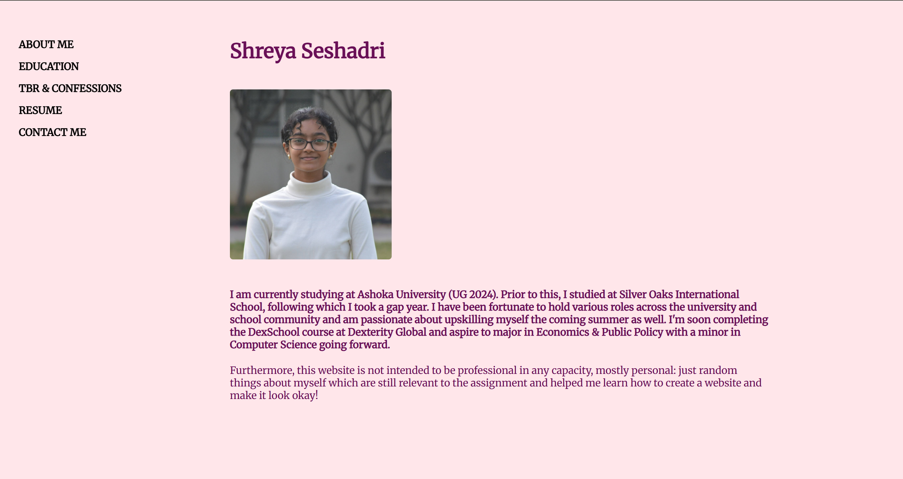
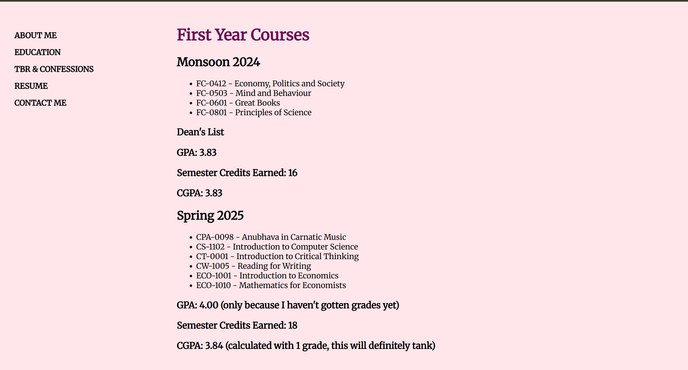
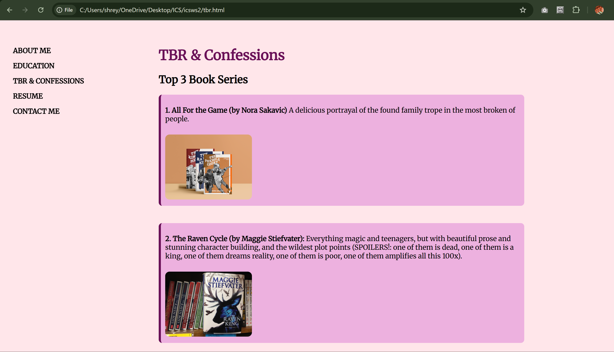
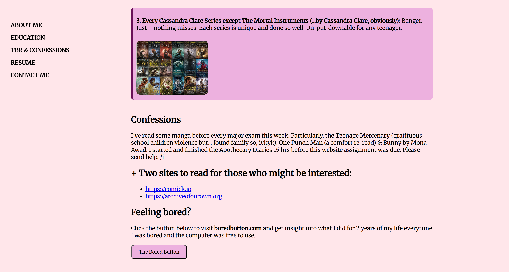

# shreya-seshadri-personal-website-ics
 
○ What the project entails (adding screenshots of the website).

An About Me page with a profile picture and basic description, my Semester 1 courses and grades, my To-Be-Read sort-of list + other miscellaneous info, resume and mailing page.

○ How to run the website (entry points and descriptions).

Clone this repository onto your device. Naviagte to Project Directory, and double click on any of index, tbr or education to open the website. Ideally the index page is the home page and entry point.

○ Features.

Inputting text and image with suitable margins. Adding a sidebar. A uniform aesthetic. Adding links, button, pages. 

○ Directory structure.

your-repo-folder
|
|-- public
| |-- assets
| | |-- images
| | | |-- b1
| | | |-- b2
| | | |-- b3
| | | |-- pic
| | | |-- s1
| | | |-- s2
| | | |-- s3
| | | |-- s4
| |-- Shreya_Seshadri_Resume
| |-- css
| | |-- styles
| |-- scripts
| | |-- tbr.js
|-- education
|-- index
|-- README
|-- tbr